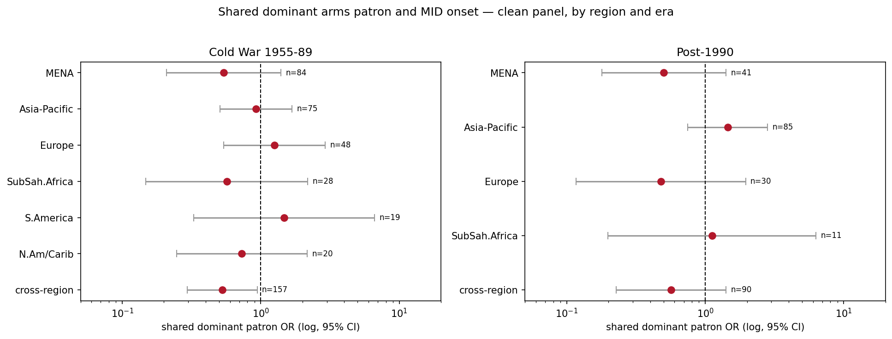

# Arms Supply, Patron Leverage, and Dispute Onset

Working repository. Yidong Yang and Zhengyi (Jerry) Zhang; advised by Paul Poast.

> **Status: active, unpublished, results superseded once.** The original global finding
> was overturned by our own diagnostics in August 2026 and rebuilt. Nothing here is
> settled, the paper is not written, and the slide deck has not been revised. Do not
> circulate any of it outside the three of us without checking `docs/PROJECT_MEMO.md`
> first.

## The claim, as it currently stands

Sharing a **dominant arms patron** — a single supplier providing ≥50% of both sides'
imports — is associated with fewer new militarized disputes, but only where patron
structures are strong: the Cold War era, cross-region patron–client dyads, and MENA.
Generic portfolio overlap, absent a dominant patron, does nothing. The constraint appears
to work through the patron's relational leverage (aid, resupply, spare parts,
conditionality) rather than through portfolio similarity as such.

| Test | OR | p |
|---|---|---|
| **Shared dominant patron, Cold War 1955–89** (declared ex ante, primary) | **0.594** | **0.001** |
| Cold War, shared US patron | 0.544 | 0.004 |
| Cold War, generic overlap gradient | 0.492 | <0.001 |
| Post-1990, shared dominant patron | 0.855 | 0.497 |
| MENA post-1990, shared US patron (hypothesis-generating) | 0.29 | 0.015 |
| Dyad fixed effects, full clean panel | 0.617 | 0.002 |
| Era interaction (patron × Cold War) | 0.721 | 0.216 |
| Cold War, shared dominant patron, 5-yr window measure + UNGA control | 0.661 | 0.005 |
| Cold War, same spec, no-defense-pact dyads only | 0.647 | 0.032 |
| Shared US patron, full period 1955–2014 | 0.646 | 0.013 |
| Escalation to war given a dispute (with controls) | 0.650 | 0.430 |
| Shared US patron × both aid-financed (financing test) | 1.042 | 0.902 |
| Cold War primary, originator dyads only | 0.692 | 0.020 |
| Cold War primary, dyads at peace 20+ years (selection check) | 0.547 | 0.039 |
| Asia-Pacific, import-dependent shared patron (goes the other way) | 1.752 | 0.001 |

Primary panel: `data/derived/clean_polrel_panel_1955_2014.csv`, 77,542 dyad-years, 1,109
onsets, politically-relevant dyads, both-importer, full controls plus peace-years,
dyad-clustered SEs.



## What is unresolved

Three things a reader should know before trusting anything above.

**The causal claim is not established.** The shift-share IV did not confirm — strong first
stage, null reduced form. The current reading is that market share is not what pacifies
and leverage is relational, which makes the case studies load-bearing rather than
decorative. But that reading is a choice; the null also admits "there is no causal effect."

**The within-dyad evidence is measure-sensitive.** Dyad fixed effects give OR 0.617
(p=0.002) with the single-year patron measure but 0.81 (p=0.16) with the five-year window
measure that is now primary — the window smooths away most of the within-dyad variation.
The IV and FE were re-run on the clean panel (`21_patron_identification.py`,
`docs/results/RESULTS_patron_identification.md`); the earlier IV results on the voided
panel are not tracked here.

**Camp David is retracted as a positive case.** MID 5.0 records seven Egypt–Israel
onsets after 1979. `RESULTS_patron_confirmation.md` was written before that check and
now carries a correction line at the top; the case design in `CASE_BACKBONES.md` uses
Iraq–Syria and Hungary–Romania, with Greece–Turkey as a shadow case and Egypt–Israel as
a boundary case.

Also open: small onset counts in regional cells; the shared-patron hypothesis was generated
post hoc in MENA and rests on the declared out-of-sample confirmation; MID 5.0 ends 2014;
alliance and CINC data end 2012 and are forward-filled through 2014; Asia-Pacific is a
consistent positive outlier; `RESULTS_import_intensity.md` shows it is not a measurement
artifact and reads it as patron indifference under a hub-and-spokes alliance design.

## Layout

```
code/
  _paths.py            repository paths — every script imports these
  01_build/            SIPRI, MID 5.0, V-Dem, CINC, alliances, contiguity, trade -> panels;
                       window and leverage measures added to the panel
  02_analysis/         patron identification, the confirmatory test, region x era,
                       escalation margin, substitutability, case backbones, financing test
  03_diagnostics/      the baseline-hardening check that overturned the original result
data/
  raw/                 third-party sources, not redistributed (see data/README.md)
  reference/           COW state list (tracked, small)
  derived/             the analysis panels (tracked)
output/figures|tables/
docs/
  PROJECT_MEMO.md      authoritative status memo, August 2026 — read this first
  STAGE_REPORT_2026-08.md
  DATA_OVERVIEW.md     source-by-source integration and the coverage caveat
  CASE_BACKBONES.md    case selection for Iraq–Syria and the Warsaw Pact dyads
  PLAIN_GUIDE.md       plain-language walkthrough
  results/             current results memos
```

### Pipeline order

```bash
python code/01_build/11_integrate.py        # SIPRI register -> bilateral TIV, overlap
python code/01_build/12_clean_panel.py      # the rebuilt unconditional panel
python code/01_build/13_mena_panel.py       # MENA complete-network panel
python code/01_build/14_window_measures.py  # trailing-window measures for the case memo
python code/01_build/15_ucdp_extension.py   # UCDP extension, 2015-2024
python code/01_build/16_leverage_measures.py # w5 main tables, continuous leverage, HHI

python code/02_analysis/21_patron_identification.py
python code/02_analysis/22_patron_confirmation.py   # the declared primary test
python code/02_analysis/23_region_era.py
python code/02_analysis/24_escalation_margin.py
python code/02_analysis/25_substitutability.py
python code/02_analysis/26_case_backbones.py
python code/02_analysis/27_financing_test.py  # Greenbook aid; adds aid columns
python code/02_analysis/28_prewrite_checks.py # selection, joiners, trade control, year FE
python code/02_analysis/29_import_intensity.py # import-dependence condition; Asia-Pacific
```

The derived panels are tracked. On a fresh clone, 21, 22, 23 and 25 run as they are;
24, 26 and 27 also need MID 5.0 and the Greenbook files in `data/raw/`; everything in
`01_build` needs the raw sources (`data/README.md` lists them). Scripts 14, 16, 25 and
27 add columns to the tracked panel in place. 22 only rebuilds the panel from raw if the
file is missing, so running it does not strip those columns; delete the panel to force
a rebuild.

`code/03_diagnostics/31_baseline_hardening.py` is the script that found the artifact. It
reads the voided 1990–2014 panel, which is deliberately **not** tracked here, so it will
not run as-is. It is kept as a record of the diagnostic, not as a step in the pipeline.

## What is deliberately not in this repository

The voided lineage: the `dyad_year_panel_1990_2014.csv` panel whose inclusion rule selected
non-importing dyads into the sample only when in conflict, the four scripts that read or
wrote it (`build_panel.R`, `identification.py`, `region_logit.py`, `bartik_iv.py`,
`iv_estimation.py`), their results memos, `FIG_overlap_by_region.png`, and the slide deck
built on them. All of it is still in the original working folder.

Also excluded: the earlier MENA counterterrorism pilot and writing sample, which is a
separate project, and personal application materials that happened to sit in the same
folder.

## Requirements

Python 3.11 with `pandas`, `numpy`, `statsmodels`, `linearmodels`, `matplotlib`, `scipy`.
No R is needed for the tracked pipeline.
